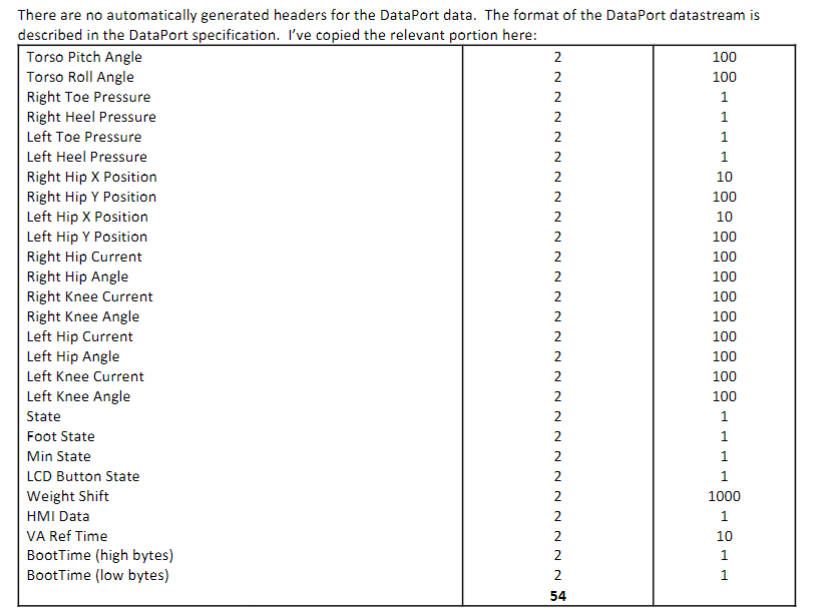

# Eksoskeleton Setup

### Δημιουργία Περιβάλλοντος

**Το περιβάλλον βρίσκεται στο φάκελο**[env](./env/)

* Για δημιουργία σε περιβάλλον Windows χρησιμοποιήστε το ακόλουθο yaml αρχείο [windows_env](./env/eksoskleton_windows.yml)
* Για δημιουργία σε περιβάλλον Linux χρησιμοποιήστε το ακόλουθο yaml αρχείο [linux_env](./env/eksoskleton_agnostic.yml)

**Για να κατασκευάσετε το περιβάλλον**
    ```
        $ conda env create -f <envirnoment_name>
    ```
    ```
        $ conda activate eksoskeleton
    ```


### Eksoskeleton Sources

 * [headers_for_ekso](../EksoNR/Dataport%20header%20for%20csr%20files.pdf)
 * [Dataport_communication](../EksoNR/DataPort_communication_protocol_1.1.pdf)
 * [Enabling_dataport](../EksoNR/Enabling%20the%20Dataport.pdf)
 * [Using the dataport](../EksoNR/Enabling%20the%20Dataport.pdf)
 * [Responses of EksoNr](../EksoNR/eksonr_issues_response.docx)

 **Headers**

 


### Connection to the dataport

 * Στον φάκελο [ekso_nr_uoi](./) εκτελέστε το client.py
        ``` 
        $ python client.py
        ```


